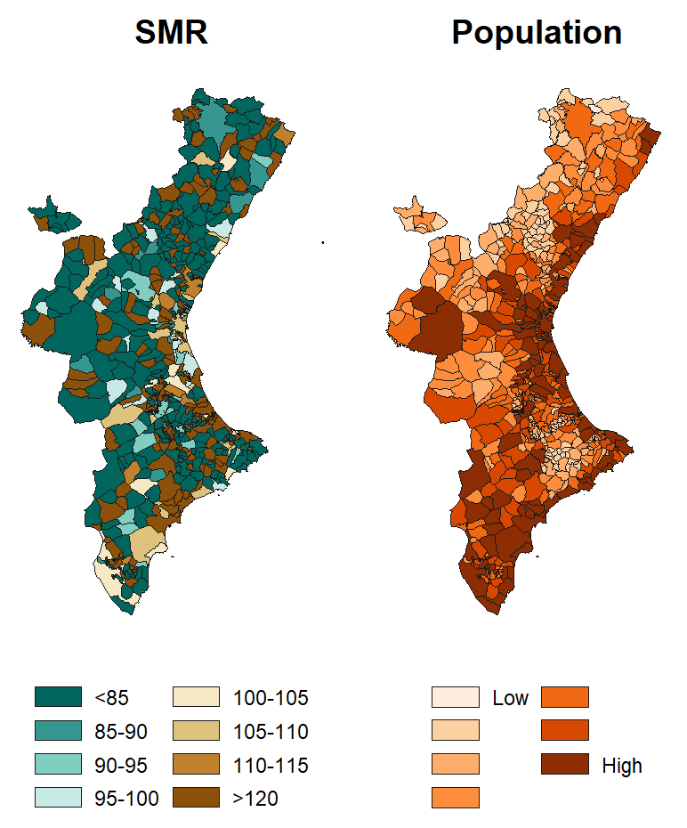

## Introducción

<div style="float: left; margin-right: 20px; width: 50%;">
  ```{r, echo=FALSE, out.width='100%'}
  
  ```
</div>

Este ejercicio tiene como objetivo explorar las técnicas de modelización espacial bayesiana para mapear tasas de mortalidad por causas específicas de muerte. Se podrá elegir cualquier causa de muerte entre dos niveles geográficos:

1. **España por provincia**, utilizando los datos del Instituto Nacional de Estadística (INE).
2. **Comunitat Valenciana por zonas de salud**, utilizando los datos del portal de la Conselleria de Sanitat Universal i Salut Pública.

El análisis se centrará en identificar patrones espaciales en la mortalidad, teniendo en cuenta factores como el número de defunciones, la población expuesta y posibles fuentes de variabilidad e incertidumbre.

---

## Objetivos

1. Modelizar tasas de mortalidad específicas por causa utilizando un enfoque bayesiano espacial.
2. Visualizar patrones espaciales en la mortalidad a nivel provincial o de zonas de salud.
3. Cuantificar la incertidumbre en las estimaciones de las tasas de mortalidad y discutir los resultados.

---

## Metodología

### 1. Elección de la causa de muerte y área de estudio

- **Datos a nivel nacional:**
  - Descargar datos desde el portal del INE.
  - Enlace: [INE - Mortalidad por causas de muerte](https://www.ine.es/jaxiT3/Tabla.htm?t=7947).

- **Datos a nivel de la Comunitat Valenciana:**
  - Descargar datos desde el portal de la Conselleria de Sanitat Universal i Salut Pública.
  - Enlace: [Conselleria de Sanitat - Mortalidad por zonas de salud](https://www.sp.san.gva.es/eolas.jsp?Opcion=SANPSSISPEOLAS&Nivel=1&MenuSup=SANMS50000&CodPunto=3416&menuRaizPortal=SANMS&perfil=inst&Idioma=es&CodPor=121&uprinPasarela=sisp).

### 2. Preparación de los datos

1. **Datos de mortalidad:**
   - Número de defunciones por causa seleccionada.
2. **Datos poblacionales:**
   - Población total o expuesta en cada área geográfica.
3. **Cálculo de la razón de mortalidad estandarizada (SMR):**
   \[
   \text{SMR} = \frac{\text{Número de defunciones}}{\text{Población expuesta}} \times 100
   \]

### 3. Especificación del modelo

El modelo bayesiano espacial deberá incluir:

- **Variable respuesta:**
  - Número de defunciones observadas en cada área geográfica.
- **Tasa esperada:**
  - Basada en tasas globales o nacionales de mortalidad para la causa seleccionada.
- **Estructura del modelo:**
  - Modelo de Besag, York y Mollié (BYM):
    \[
    y_i \sim \text{Poisson}(\mu_i), \quad \mu_i = E_i \cdot \exp(\eta_i)
    \]
    \[
    \eta_i = \alpha + u_i + v_i + \epsilon_i,
    \]
    donde:
    - \( E_i \): Número esperado de defunciones.
    - \( u_i \): Efecto espacial estructurado (correlación entre áreas vecinas).
    - \( v_i \): Efecto espacial no estructurado.
    - \( \epsilon_i \): Variabilidad residual.

### 4. Implementación en INLA

- Utilizar el paquete `INLA` para:
  - Ajustar el modelo BYM.
  - Estimar efectos espaciales estructurados y no estructurados.
  - Generar mapas de tasas de mortalidad ajustadas y su incertidumbre.

### 5. Visualización de resultados

1. **Mapas:**
   - Crear mapas que muestren:
     - SMR ajustadas por área.
     - Intervalos de credibilidad para las estimaciones.
2. **Análisis espacial:**
   - Identificar áreas con tasas significativamente altas o bajas.

---

## Lecturas recomendadas


1. Gómez-Rubio, V. (2020). *Bayesian inference with INLA*. Chapman and Hall/CRC. ISBN: 9781138499726.
2. Martínez-Beneito, M. Á., & Botella-Rocamora, P. (2019). *Disease Mapping: From Foundations to Multidimensional Modeling*. Chapman and Hall/CRC. ISBN: 9780367178153.
3. Martínez Minaya, J. (2024). Ejemplo práctico de mapeo de enfermedades en el curso BayesianHealth. Disponible en: [BayesianHealth GitHub](https://github.com/jmartinez-minaya/BayesianHealth/blob/main/PART-III/examples/S3-INLA-disease-mapping/S3-INLA-disease_mapping.Rmd).

