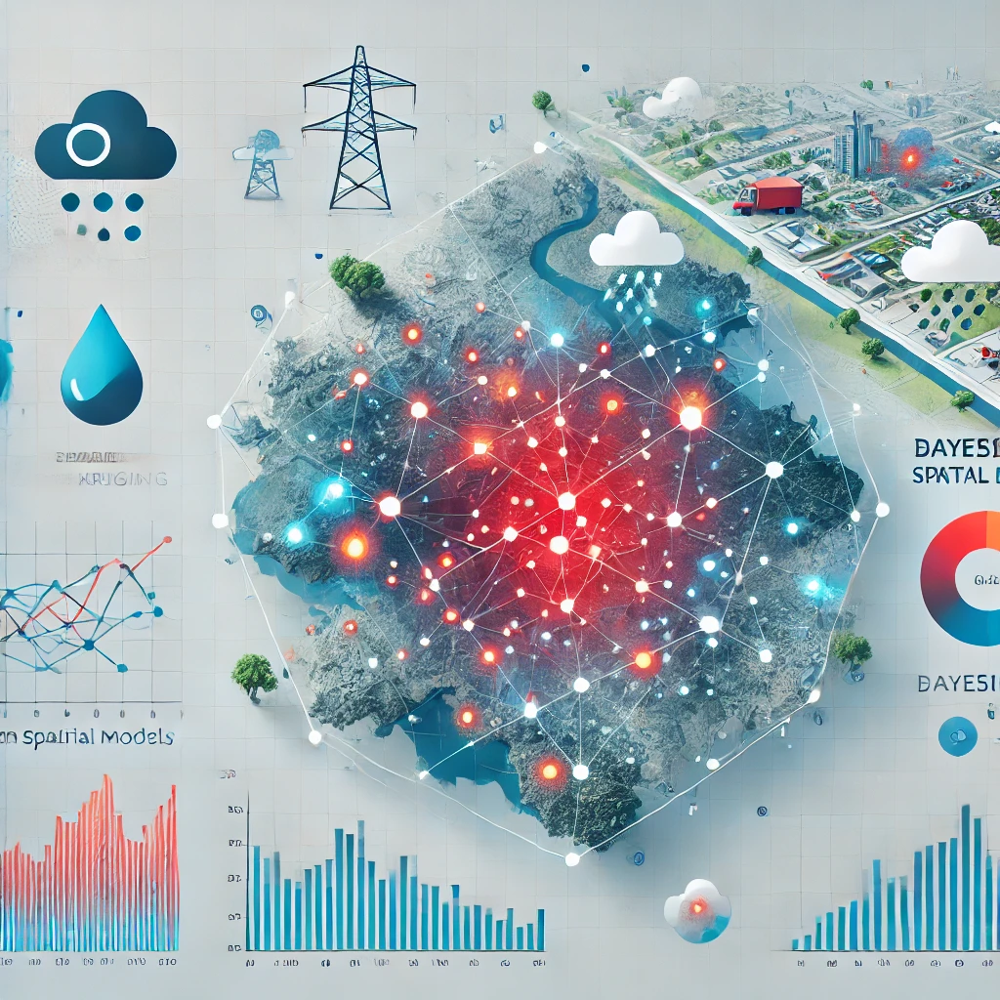

## Introducción

<div style="float: left; margin-right: 20px; width: 50%;">
  ```{r, echo=FALSE, out.width='100%'}
  
  ```
</div>


En este trabajo, se utilizarán técnicas de geoestadística bayesiana para modelar y predecir los niveles de contaminación en la Comunitat Valenciana antes y después de la DANA (Depresión Aislada en Niveles Altos). El análisis se centrará en comparar las concentraciones máximas mensuales de un contaminante atmosférico clave, como PM10, PM2.5 o NO2, durante los meses de septiembre (antes de la DANA) y noviembre (después de la DANA).

La contaminación del aire es un problema crítico para la salud pública y el medio ambiente. Este ejercicio permitirá identificar patrones espaciales en la distribución de los contaminantes, así como zonas con posibles niveles elevados de contaminación, y explorar el impacto de eventos meteorológicos extremos como la DANA.

**Datos:**

Los datos necesarios para este ejercicio pueden descargarse desde el siguiente enlace:

[Conselleria de Transición Ecológica - Datos de Calidad del Aire](https://mediambient.gva.es/es/web/calidad-ambiental/datos-on-line)

---

## Objetivos

1. Modelizar y predecir la distribución espacial de un contaminante atmosférico seleccionado (PM10, PM2.5 o NO2) antes y después de la DANA.
2. Aplicar técnicas de geoestadística bayesiana para realizar una interpolación de niveles de contaminación en áreas no muestreadas.
3. Comparar los patrones espaciales de contaminación en septiembre y noviembre.
4. Evaluar la incertidumbre en las predicciones y discutir las diferencias entre los niveles de contaminación en ambos períodos.

---

## Metodología

### 1. Selección del contaminante y descarga de datos

1. Visitar el portal de la Conselleria de Transición Ecológica.
2. Seleccionar uno de los contaminantes disponibles:
   - PM10
   - PM2.5
   - NO2
3. Descargar los datos horarios correspondientes, incluyendo:
   - Concentraciones horarias del contaminante.
   - Coordenadas de las estaciones de monitoreo.
   - Información adicional relevante (población, características del área, etc.).

### 2. Preparación de los datos

1. **Cálculo de concentraciones máximas:**
   - Para cada estación, calcular el máximo mensual para los meses de septiembre y noviembre.
2. **Exploración inicial:**
   - Analizar la distribución de los niveles máximos de contaminación registrados.
   - Identificar posibles valores atípicos o datos faltantes.
3. **Georreferenciación:**
   - Asegurar que las coordenadas de las estaciones estén correctamente especificadas.

### 3. Modelo geoestadístico bayesiano

   - Utilizar un modelo de kriging bayesiano similar al utilizado en [Ejemplo de geoestadística ](https://github.com/jmartinez-minaya/BayesianHealth/blob/main/PART-III/examples/S3-inlabru-geostatistics/S3-inlabru-geostatistics_malaria.rmd)
para la predicción espacial de los niveles máximos de contaminación     
   - Generar mapas interpolados de los niveles máximos de contaminación en áreas no muestreadas para septiembre y noviembre.

### 4. Comparación y evaluación de incertidumbre

1. Comparar los patrones espaciales de contaminación antes y después de la DANA:
   - Identificar áreas con diferencias significativas en los niveles de contaminación.
2. Generar intervalos de predicción para las concentraciones estimadas en ambos períodos.

---

## Lecturas recomendadas

1. Moraga, P. (2019). *Geospatial Health Data: Modeling and Visualization with R-INLA and Shiny*. Chapman and Hall/CRC. ISBN: 9780367134210.
2. Gómez-Rubio, V. (2020). *Bayesian inference with INLA*. Chapman and Hall/CRC. ISBN: 9781138499726.
3. Martínez Minaya, J. (2024). Ejemplo práctico de geoestadística en el curso BayesianHealth. Disponible en: [BayesianHealth GitHub](https://github.com/jmartinez-minaya/BayesianHealth/blob/main/PART-III/examples/S3-inlabru-geostatistics/S3-inlabru-geostatistics_malaria.rmd).
4. Fioravanti, G., Martino, S., Cameletti, M., & Cattani, G. (2021). Spatio-temporal modelling of PM10 daily concentrations in Italy using the SPDE approach. *Atmospheric Environment*, 248, 118192. https://doi.org/10.1016/j.atmosenv.2020.118192.


